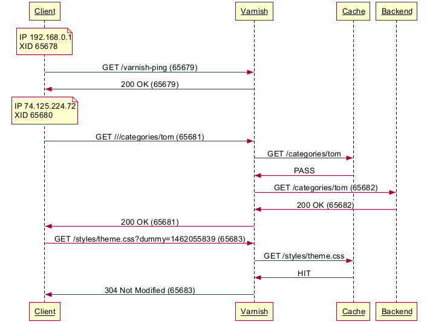

# Varnishlog Parser

A standalone tool to transform a Varnish output file into a simple diagram sequence.

## Requirements

 * Varnish 4.1
 * PHP 5 (tested with PHP 5.6) or PHP 7.0
 * cURL (`sudo apt-get install php5-curl` or `php-curl`)
 * Internet access to websequencediagrams.com (generated diagram)

## Installation and usage

First, you need to **generate a varnishlog output**.

 * Log in your Varnish server
 * Execute this command: `varnishlog -g raw > /tmp/output.log`
 * Navigate on your website for few seconds, then kill varnishlog with `Ctrl+C`
 * Get the output file on your computer

Then, **install** this tool:

 * `git clone <this URL>` varnishlog-parser
 * `cd varnishlog-parser`
 * `git submodule init`
 * `git submodule update`, to download the Kint library

Finally, **execute** the web client:

 * `php -S 127.0.0.1:8080 client.php`
 * Go to http://127.0.0.1:8080/
 * Enter the local path to your `output.log` file in the first form
 * Have fun!

## Contributing

Feel free to submit pull requests. The code is documented, but the logic is still complex (because Varnishlog is).

## Known bugs

This is a week-end project, home alone, so it's not fully tested and there are obviously many hidden bugs. Nevertheless, main unusual use cases have been tested (ESI, restarts, truncated file, synth response, custom vmods, ...).

* In some edge cases, transactions order might not be fully respected.

## Todo

* Set apart different clients (by IP)
* Set apart different backends (by backend name or IP)
* Parse and graph cookies
* Add timestamps
* Complete documentation

## License

See the [LICENSE](LICENSE.txt) file for license rights and limitations (MIT).

## Thanks

Special thanks to :

 * Poul-Henning Kamp and all the [Varnish Software](https://www.varnish-software.com/) team
 * Shohei Tanaka for the [Vsltrans](http://vsltrans.varnish.jp/) project
 * [Websequencediagrams.com](https://www.websequencediagrams.com/) and its nice (and free!) API
 * [Kint](http://raveren.github.io/kint/), `print_r()` on steroids

